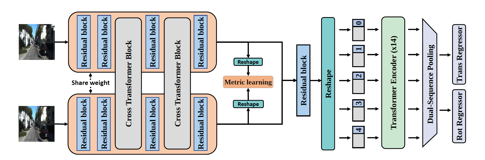
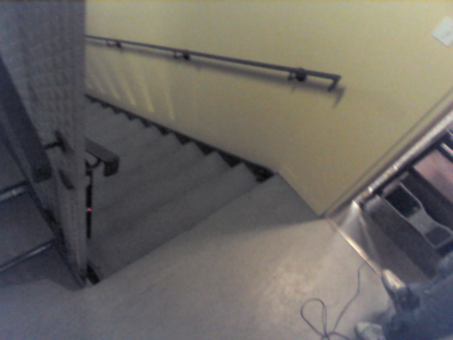
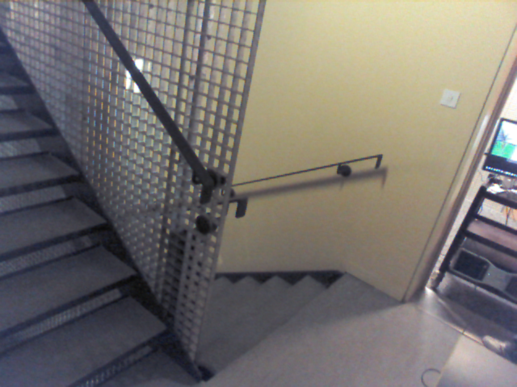

### Introduction
We presents a novel siamese convolutional transformer model, SiTPose, to regress relative camera pose directly.

### Citation
```lateX
@inProceedings{Leng2023SiTPose,
author = {Kai Leng and Cong Yang and Wei Sui and Jie Liu and Zhijun Li},
title = {SiTPose: A Siamese Convolutional Transformer for Relative Camera Pose Estimation},
booktitle = {International Conference on Multimedia and Expo},
year = 2023
}
```
### License
This project is released under the [license](./LICENSE)
### Usage
---
#### 1. Install requirements
##### create  conda envirment
```bash
conda create -n SiTPose python=3.7
conda activate SiTPose
```
##### install requirements
```bash
conda install pytorch==1.10.0 torchvision==0.11.1 cudatoolkit=11.1 -c pytorch -c nvidia
pip3 install scipy==1.7.3
pip3 install opencv-python==4.6.0.66
pip3 install git+https://github.com/princeton-vl/lietorch.git
```

#### 2. Test Demo
Step 1. download the [SiTPose(light version)](https://drive.google.com/file/d/1eUrdVr7WOOt5cMdCUXvuJF3HJi0As_8e/view?usp=sharing) and save it bellow:

```
SiTPose/
└── checkpoints/
        └── SiTPose_light
```

Step 2 run test on Demo images
```
python demo.py
```

| image1 |image2 |
|--|--|
|   | | 

|           | t_x | t_y | t_z | q_x | q_y | q_z | q_w |
| ----------- | --- | --- | --- | --- | --- | --- | --- |
| GroundTruth |  -0.8152  |  0.3475   |-0.2745     |  0.2374   |0.0293     |  0.1013   | 0.9656    |
| Predict            | -0.8171    |    0.3551|  -0.2785   | 0.2399    | 0.0306     | 0.1024    |  0.9642     |


#### 3.Prepare data
- 7Scenes dataset can be obtained from [https://www.microsoft.com/en-us/research/project/rgb-d-dataset-7-scenes/](https://www.microsoft.com/en-us/research/project/rgb-d-dataset-7-scenes/).
```
SiTPose/
└── data/
    └── 7Scenes
        └── Chess
        └── Fire
        └── Heads
        └── Office
        └── Pumpkin
        └── RedKitchen
        └── Stairs
        └── generate_data.py
        └── db_all_med_hard_train.txt
        └── db_all_med_hard_valid.txt
```

```bash
cd data/7Scenes
python3 generate_data.py
```

#### 4. Training and Eval
```bash
#SiTPose
#start training
python3 train.py 

#eval
python eval.py

#SiTPose-light, the light version of SiTPose while maintaining the same level of accuracy as the original version.
#start training
python3 train_light.py 

#eval
python eval_light.py

```

### 4.Reference
[8-point](https://github.com/crockwell/rel_pose)

[CCT](https://github.com/SHI-Labs/Compact-Transformers)

[HomographyNet](https://github.com/richard-guinto/homographynet)

